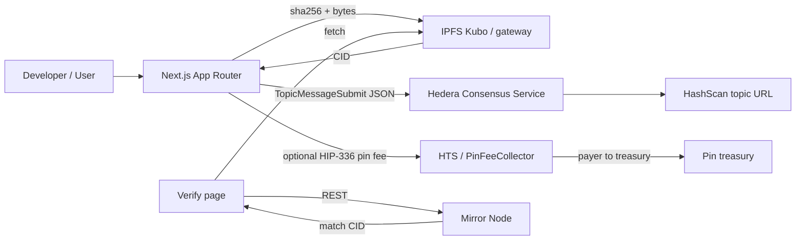

# HCS-anchored IPFS Document Vault

> Scaffold-HBAR external template: upload a document to **IPFS**, attest `{cid, sha256, size, payer, memo, ts}` on a **Hedera Consensus Service** topic, optionally pay a non-custodial **HIP-336 pin fee**, and verify via Mirror Node + HashScan.

**Without IPFS there is nowhere for the bytes. Without HCS there is no public, tamper-evident proof.** Both are load-bearing.

```bash
npm create scaffold-hbar@latest --template <YOUR_ORG>/<YOUR_REPO>
```

(Local self-check with an absolute template dir is documented below.)

## Why this pattern

| Piece | Role |
| --- | --- |
| **IPFS** | Content-addressed storage for document bytes (ecosystem integration). |
| **HCS** | Ordered, public consensus messages anchoring CID + sha256 + payer. |
| **Mirror Node** | Read path for verify (no custom indexer required). |
| **Optional HTS pin fee** | HIP-336 allowance + CryptoTransfer (or thin `PinFeeCollector`) payer → treasury. |

This is **not** an x402 S3 paywall, not a DEX checkout, and not a SaucerSwap merchant flow.

## Architecture



## Monorepo layout

```
packages/
  ledger/    Pure helpers: sha256, attestation schema, HashScan/IPFS URL builders, bigint money
  hardhat/   Optional PinFeeCollector (non-custodial HBAR / ERC20-style pin fee)
  nextjs/    App Router UI + API routes + yarn demo:attest
```

Package manager: **Yarn 3.2.3** workspaces **and** npm. Internal deps use `"@vault/ledger": "*"`, not `workspace:*`. Node **≥ 20.18.3**.

## Prerequisites

1. Node.js ≥ 20.18.3
2. Yarn 3.2.3 via the bundled `.yarn/releases/yarn-3.2.3.cjs` (or Corepack)
3. Hedera testnet account + HBAR from the [portal faucet](https://portal.hedera.com/faucet)
4. Local [Kubo](https://docs.ipfs.tech/install/command-line/) (`ipfs daemon`, API on `127.0.0.1:5001`) **or** a precomputed CID for dry-run

## Quick start

```bash
cp .env.example .env
cp packages/nextjs/.env.example packages/nextjs/.env.local
# Edit .env: HEDERA_ACCOUNT_ID, HEDERA_PRIVATE_KEY

yarn install          # or: npm install
yarn lint
yarn test
yarn build

# Create topic + one-click attestation (needs funded keys)
yarn demo:topic
yarn demo:attest

yarn next:dev
```

npm equivalents:

```bash
npm install
npm run lint
npm run test
npm run build
npm run demo:topic -w @vault/nextjs
npm run demo:attest -w @vault/nextjs
npm run next:dev
```

### Env vars

See `.env.example`. Server routes also load the monorepo root `.env`.

| Key | Required | Description |
| --- | --- | --- |
| `HEDERA_ACCOUNT_ID` | yes (demo) | Operator `0.0.x` |
| `HEDERA_PRIVATE_KEY` | yes (demo) | Operator key — **never commit** |
| `HCS_TOPIC_ID` | yes (attest) | Topic for vault messages |
| `IPFS_API_URL` | happy path | Kubo HTTP API (default `http://127.0.0.1:5001`) |
| `IPFS_GATEWAY_URL` | no | Public fetch base (default `https://ipfs.io/ipfs`) |
| `PIN_TOKEN_ID` | no | If set with fee + treasury → HIP-336 pin fee; else free attest |
| `PIN_FEE_AMOUNT` | no | Base units as bigint string |
| `PIN_TREASURY_ACCOUNT_ID` | no | Receives pin fee |
| `PIN_FEE_CONTRACT_ADDRESS` | no | Optional deployed `PinFeeCollector` |

`template.json` `envVars` entries are `{key, description}` only (Zod-valid for create-scaffold-hbar).

## Product behaviour

1. **Upload** — client hashes sha256; bytes go to IPFS HTTP API (or precomputed CID dry-run); you get a CID.
2. **Attest** — `TopicMessageSubmit` with JSON `{cid, sha256, size, payer, memo, ts}`; UI shows sequence number + HashScan URL pattern `https://hashscan.io/<network>/topic/<topicId>/<sequence>`.
3. **Optional pin fee** — if `PIN_TOKEN_ID` is set: HIP-336 `AccountAllowanceApproveTransaction`, then non-custodial CryptoTransfer payer → treasury. If unset: free attest (network HBAR fee only). Thin Solidity `PinFeeCollector` available under `packages/hardhat`.
4. **Verify** — paste CID → Mirror Node topic messages → match + “Fetch from IPFS”.
5. **One-click demo** — `yarn demo:attest` / `npm run demo:attest -w @vault/nextjs`.

### IPFS notes

- Happy path: Next.js `POST /api/ipfs/add` pins to configurable `IPFS_API_URL` (Kubo).
- Dry-run: pass `precomputedCid` (UI field or `DEMO_PRECOMPUTED_CID`).
- Optional: document a public add endpoint via form field `publicAddUrl`.
- **If IPFS is removed, the vault has nowhere to put document bytes** — only hashes/CIDs remain abstract.

## Status & roadmap

Honest status from this workspace (Asia/Yerevan). Do not claim commands you have not run.

| Milestone | Command | Result |
| --- | --- | --- |
| Template tree | — | Present at repo root (`packages/ledger`, `hardhat`, `nextjs`) |
| `yarn install` | `yarn install` (Yarn 3.2.3) | **PASS** (2026-09-18) |
| `npm install` | fresh copy `npm install` | **PASS** (2026-09-18; 1162 packages) |
| Lint | `yarn lint` | **PASS** |
| Unit tests | `yarn test` | **PASS** — 8 ledger + 3 Hardhat |
| Build | `yarn build` | **PASS** — ledger + Hardhat compile + Next.js |
| Local `create-scaffold-hbar` | `CREATE_SCAFFOLD_HBAR_TEMPLATE_DIR=… npx create-scaffold-hbar@0.4.0 … --skip-install` | **PASS** with isolated HOME git identity (CLI requires `user.name` / `user.email`) |
| Create topic | `yarn demo:topic` | **PASS** — topic [`0.0.10600873`](https://hashscan.io/testnet/topic/0.0.10600873) |
| Demo attest + HashScan | `yarn demo:attest` | **PASS** — seq 1 [`HashScan message`](https://hashscan.io/testnet/topic/0.0.10600873/1) · tx [`0.0.10600860@…`](https://hashscan.io/testnet/transaction/0.0.10600860%401789727716.782379131) (CID dry-run without local Kubo; HCS proof is live) |
| App routes | `yarn next:start` smoke | **PASS** — `/`, `/upload`, `/verify` returned HTTP 200 |

## Local create-scaffold-hbar self-check

Do **not** claim success unless this actually ran:

```bash
corepack enable
CREATE_SCAFFOLD_HBAR_TEMPLATE_DIR=/absolute/path/to/hcs-ipfs-document-vault \
  npx --yes create-scaffold-hbar@0.4.0 vault-app \
  -f nextjs-app -s hardhat --package-manager npm --network testnet \
  --ci --skip-install --skip-hedera-skills
```

## Optional pin-fee contract

```bash
yarn hardhat:compile
yarn hardhat:test
# With deployer key / PIN_TREASURY_EVM_ADDRESS:
yarn hardhat:deploy --network hederaTestnet
```

Money amounts use **bigint** base units (see `@vault/ledger` `toBaseUnits` / `hbarToTinybar`). No floats for money. No custodial hop.

## Licence

MIT — see [LICENSE](./LICENSE).

## Links

- [Scaffold-HBAR Template Bounty](https://hedera.com/blog/scaffold-hbar-template-bounty/)
- [Hedera portal faucet](https://portal.hedera.com/faucet)
- [HashScan testnet](https://hashscan.io/testnet)
- [Kubo / IPFS](https://docs.ipfs.tech/)
