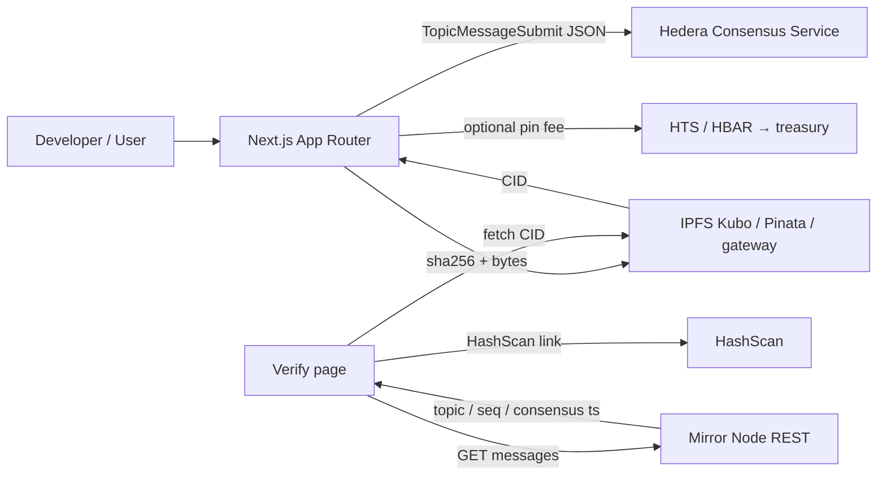

# HCS-anchored IPFS Document Vault

> Scaffold-HBAR external template: upload a document to **IPFS**, attest schema-v1 `{schemaVersion, cid, sha256, size, payer, memo, ts, mime?, prevCid?}` on a **Hedera Consensus Service** topic, optionally pay a non-custodial **HIP-336 / native HBAR pin fee**, and verify via Mirror Node + HashScan.

**Without IPFS there is nowhere for the bytes. Without HCS there is no public, tamper-evident proof.** Both are load-bearing.

```bash
npm create scaffold-hbar@latest --template 374group-tech/hcs-ipfs-document-vault
```

(Local self-check with an absolute template dir is documented below.)

---

## 5-minute path (scaffold → run → upload → attest → verify)

Exact commands judges and developers can paste. Full click-through: [docs/DEMO.md](./docs/DEMO.md) · ops detail: [RUNBOOK.md](./RUNBOOK.md).

```bash
# 0) clone / scaffold, then from this repo root:
cp .env.example .env
cp packages/nextjs/.env.example packages/nextjs/.env.local
# Edit .env — required for live attest:
#   HEDERA_ACCOUNT_ID=0.0.x
#   HEDERA_PRIVATE_KEY=…   # never commit

yarn install                 # or: npm install
yarn lint && yarn test && yarn build

# 1) Create HCS topic (funded testnet account from portal faucet)
yarn demo:topic              # prints + writes HCS_TOPIC_ID=0.0.…

# 2a) Happy path — local Kubo (or IPFS_PROVIDER=pinata + PINATA_JWT)
ipfs daemon &                # API http://127.0.0.1:5001
yarn demo:attest             # IPFS add → HCS submit schema v1 → HashScan URL

# 2b) Dry-run — HCS-only with a precomputed CID (no Kubo)
DEMO_PRECOMPUTED_CID=bafybeigdyrzt5sfp7udm7hu76uh7y26nf3efuylqabf3oclgtqy55fbzdi \
  yarn demo:attest

# 3) CLI verify (Mirror Node → match CID → HashScan)
yarn verify:proof <CID>                 # uses HCS_TOPIC_ID from .env
# yarn verify:proof <CID> --topic 0.0.x --sequence N

# 4) UI: upload → attest → verify
yarn next:dev                # http://localhost:3000
#   /upload  — file or precomputed CID → IPFS → HCS (writes schema v1)
#   /verify  — paste CID → Mirror Node match → HashScan + fetch IPFS
```

npm equivalents: `npm run demo:topic -w @vault/nextjs`, `npm run demo:attest -w @vault/nextjs`, `npm run verify:proof -w @vault/nextjs -- <CID>`, `npm run next:dev`.

**Expected attest stdout:** `sequenceNumber=…` and  
`https://hashscan.io/testnet/topic/<HCS_TOPIC_ID>/<sequence>`.

---

## Why this pattern

**Ecosystem integration (rubric: 35 pts):** [decentralised storage](https://docs.ipfs.tech/) via **IPFS** — load-bearing, not decorative. IPFS supplies the content-addressed blob (CID); HCS notarizes `{cid, sha256, …}`. **Remove IPFS → no durable document blob / CID.** Remove HCS → no ordered, tamper-evident public attest.

| Piece | Role |
| --- | --- |
| **IPFS** | Decentralised storage for document bytes (CID). Required. |
| **HCS** | Ordered consensus messages anchoring CID + sha256 + payer. |
| **Mirror Node** | Read path for verify (no custom indexer). |
| **Optional pin fee** | HIP-336 / native HBAR CryptoTransfer payer → treasury. |

Attestation JSON is **schema v1** on write (`schemaVersion: 1`, optional `mime` / `prevCid` revision chain). Verify still accepts **legacy** messages without `schemaVersion`. Details: [docs/SCHEMA.md](./docs/SCHEMA.md).

This is **not** an x402 S3 paywall, not a DEX checkout, and not a SaucerSwap merchant flow.

## Architecture (one-pager)



Static diagram: [docs/assets/architecture.svg](./docs/assets/architecture.svg) · screenshot checklist: [docs/assets/README.md](./docs/assets/README.md).

**Composition:** upload bytes → IPFS CID → client `sha256` → `TopicMessageSubmit` → verify via Mirror Node (topic, sequence, consensus timestamp) + HashScan (+ fetch blob from IPFS). Live proofs: [Status & roadmap](#status--roadmap).

## Monorepo layout

```
packages/
  ledger/    Pure helpers: sha256, attestation schema, HashScan/Mirror/IPFS URLs, bigint money
  hardhat/   Optional PinFeeCollector (non-custodial HBAR / ERC20-style pin fee)
  nextjs/    App Router UI + API routes + yarn demo:attest
docs/        DEMO.md · SCHEMA.md · assets/architecture.svg + screenshot checklist
```

Package manager: **Yarn 3.2.3** workspaces **and** npm. Internal deps use `"@vault/ledger": "*"`, not `workspace:*`. Node **≥ 20.18.3**.

## Package scripts (root)

| Script | What it does |
| --- | --- |
| `yarn lint` / `yarn test` / `yarn build` | Gate across `ledger` + `hardhat` + `nextjs` |
| `yarn next:dev` | App Router UI (`/`, `/upload`, `/verify`) |
| `yarn demo:topic` | Create HCS topic → writes `HCS_TOPIC_ID` |
| `yarn demo:attest` | IPFS add → HCS schema-v1 submit → HashScan URL |
| `yarn verify:proof <CID>` | Mirror Node match (legacy + v1); exit 0/1 |
| `yarn hardhat:compile` / `yarn hardhat:test` / `yarn hardhat:deploy` | Optional `PinFeeCollector` |

Workspace equivalents: `npm run <script>` or `npm run <script> -w @vault/nextjs` for nextjs-only scripts.

## Prerequisites

1. Node.js ≥ 20.18.3
2. Yarn 3.2.3 via `.yarn/releases/yarn-3.2.3.cjs` (or Corepack)
3. Hedera testnet account + HBAR from the [portal faucet](https://portal.hedera.com/faucet)
4. Local [Kubo](https://docs.ipfs.tech/install/command-line/) (`ipfs daemon`, API `127.0.0.1:5001`), **or** `IPFS_PROVIDER=pinata` + `PINATA_JWT`, **or** a precomputed CID for dry-run

## Env table

Copy roots: `cp .env.example .env` and `cp packages/nextjs/.env.example packages/nextjs/.env.local`. Server routes also load the monorepo root `.env`.

| Key | Required | Description |
| --- | --- | --- |
| `HEDERA_ACCOUNT_ID` | yes (live) | Operator `0.0.x` |
| `HEDERA_PRIVATE_KEY` | yes (live) | Operator key — **never commit** |
| `HEDERA_NETWORK` | no | `testnet` (default) or `mainnet` |
| `HCS_TOPIC_ID` | yes (attest/verify) | Topic for vault messages (`yarn demo:topic`) |
| `HEDERA_MIRROR_NODE_URL` | no | Mirror REST (default public testnet/mainnet) |
| `IPFS_PROVIDER` | no | `kubo` (default) or `pinata` |
| `IPFS_API_URL` | happy path (kubo) | Kubo HTTP API (default `http://127.0.0.1:5001`) |
| `IPFS_GATEWAY_URL` | no | Public fetch base (default `https://ipfs.io/ipfs`) |
| `PINATA_JWT` | pinata | Pinata JWT — **never commit** |
| `PINATA_API_KEY` / `PINATA_API_SECRET` | pinata alt | Legacy Pinata key pair if no JWT |
| `PIN_TOKEN_ID` | no | `HBAR` / `0.0.0` or HTS id → pin fee; unset = free attest |
| `PIN_FEE_AMOUNT` | no | Base units as bigint string (tinybars if HBAR) |
| `PIN_TREASURY_ACCOUNT_ID` | no | Receives pin fee |
| `PIN_FEE_CONTRACT_ADDRESS` | no | Optional deployed `PinFeeCollector` |
| `NEXT_PUBLIC_*` | no | Safe client mirrors of network / topic / gateway / pin |

`template.json` `envVars` entries are `{key, description}` only (Zod-valid for create-scaffold-hbar).

## Troubleshooting

| Symptom | Cause | Fix |
| --- | --- | --- |
| `IPFS API unreachable` / Kubo upload fails | Kubo not running or wrong `IPFS_API_URL` | Start `ipfs daemon` (API `127.0.0.1:5001`) or use dry-run CID |
| Pinata pin / auth fails | Missing or invalid Pinata creds | Set `IPFS_PROVIDER=pinata` and `PINATA_JWT` (never commit); or switch back to Kubo / dry-run |
| `yarn verify:proof` → match=no | Wrong topic / lag / CID | Confirm `HCS_TOPIC_ID`; wait a few seconds after attest; try `--sequence N` |
| `HEDERA_ACCOUNT_ID and HEDERA_PRIVATE_KEY are required` | Missing keys | Fill `.env` from [portal faucet](https://portal.hedera.com/faucet); never commit |
| `Unable to parse HEDERA_PRIVATE_KEY` | Wrong key format | ECDSA or ED25519 hex/DER from portal; no quotes/spaces |
| `HCS_TOPIC_ID is required` | No topic yet | `yarn demo:topic` then re-run attest |
| Mirror verify empty / no match | Lag or wrong topic | Wait a few seconds after submit; confirm topic id matches attest |
| Dry-run vs live | Dry-run = HCS message only | Production still needs real bytes on IPFS; dry-run CID is demo-only |
| `yarn` / npm workspace resolve fails | Wrong dep protocol | Use `"@vault/ledger": "*"` and root `workspaces` |
| Lint fails on Hardhat | Compile order | Root `yarn lint` compiles Hardhat first (see package scripts) |

## Product behaviour

1. **Upload** — client hashes sha256; bytes → IPFS provider (`kubo` or `pinata`) or precomputed CID dry-run → CID.
2. **Attest** — `TopicMessageSubmit` with schema-v1 JSON `{schemaVersion:1, cid, sha256, size, payer, memo, ts, mime?, prevCid?}`; UI shows sequence + HashScan `…/topic/<id>/<sequence>`.
3. **Optional pin fee** — if `PIN_TOKEN_ID` set: native HBAR CryptoTransfer or HIP-336 allowance + transfer payer → treasury. Else free attest (network fee only).
4. **Verify** — `yarn verify:proof <CID>` or UI paste CID/sequence → Mirror Node → match (legacy + v1) with topic / seq / consensus timestamp + HashScan + “Fetch from IPFS”.
5. **One-click demo** — `yarn demo:attest` / `npm run demo:attest -w @vault/nextjs`.

### IPFS notes (load-bearing)

- Happy path: Next.js `POST /api/ipfs/add` uses `IPFS_PROVIDER` (`kubo` default → `IPFS_API_URL`, or `pinata` → `PINATA_JWT`).
- Dry-run: `precomputedCid` (UI) or `DEMO_PRECOMPUTED_CID` — works with **no** provider; demo only; production needs real bytes on IPFS.
- Optional: public add endpoint via form field `publicAddUrl` (legacy fallback).
- **If IPFS is removed, the product breaks:** no durable document blob / CID. HCS alone only notarizes a hash of bytes it never held.

### `yarn verify:proof`

```bash
yarn verify:proof bafy…                         # HCS_TOPIC_ID from .env
yarn verify:proof bafy… --topic 0.0.10600873
yarn verify:proof bafy… --topic 0.0.x --sequence 3
```

Prints `match=yes|no`, `sequence`, `consensusTimestamp`, `hashScanUrl`, `sha256` (and `schemaVersion` / `prevCid` when present). Exit `0` on match, `1` on no match / error.

## Status & roadmap

Honest status from this workspace (Asia/Yerevan). Do not claim commands you have not run.

**Judge-facing HashScan proofs (IPFS + HCS + optional HBAR pin):** topic [`0.0.10600873`](https://hashscan.io/testnet/topic/0.0.10600873) · **schema v1** seq [4](https://hashscan.io/testnet/topic/0.0.10600873/4) (CID `bafkreic5ywzvohvo6kbiuym2q57omcfruwgfrbekfip73h33jqjdolgdaq`, `prevCid` → legacy) · **legacy** seq [3](https://hashscan.io/testnet/topic/0.0.10600873/3) · pin [transfer](https://hashscan.io/testnet/transaction/0.0.10600860%401789747920.746708423). Both validate via `yarn verify:proof`. Full table below.

| Milestone | Command | Result |
| --- | --- | --- |
| Template tree | — | Present at repo root (`packages/ledger`, `hardhat`, `nextjs`) |
| `yarn install` | `yarn install` (Yarn 3.2.3) | **PASS** (2026-09-18) |
| `npm install` | fresh copy `npm install` | **PASS** (2026-09-18; 1162 packages) |
| Lint | `yarn lint` | **PASS** (2026-09-23) |
| Unit tests | `yarn test` | **PASS** (2026-09-23) — ledger + Hardhat + nextjs |
| Build | `yarn build` | **PASS** (2026-09-23) — ledger + Hardhat compile + Next.js |
| Local `create-scaffold-hbar` | `CREATE_SCAFFOLD_HBAR_TEMPLATE_DIR=… npx create-scaffold-hbar@0.4.0 … --skip-install` | **PASS** (2026-09-23 Asia/Yerevan) with isolated HOME git identity |
| Create topic | `yarn demo:topic` | **PASS** — topic [`0.0.10600873`](https://hashscan.io/testnet/topic/0.0.10600873) |
| Local Kubo IPFS | `ipfs daemon` + API `:5001` | **PASS** — add source=`kubo` |
| HBAR pin fee | `PIN_TOKEN_ID=HBAR` | **PASS** — 100000 tinybar → treasury [`0.0.10604200`](https://hashscan.io/testnet/account/0.0.10604200) · [transfer](https://hashscan.io/testnet/transaction/0.0.10600860%401789747920.746708423) |
| Demo attest (legacy) | `yarn demo:attest` | **PASS** (2026-09-18) — HCS seq [3](https://hashscan.io/testnet/topic/0.0.10600873/3) · Kubo CID `bafkreif7ckqfqbizpthadxlizpgwlgujq6lv3uj26ef2bshy4n2kyd2yny` · [tx](https://hashscan.io/testnet/transaction/0.0.10600860%401789747921.086074708) |
| Schema v1 attest + `prevCid` | `DEMO_PREV_CID=… yarn demo:attest` | **PASS** (2026-09-23 Asia/Yerevan) — HCS seq [4](https://hashscan.io/testnet/topic/0.0.10600873/4) · Kubo CID `bafkreic5ywzvohvo6kbiuym2q57omcfruwgfrbekfip73h33jqjdolgdaq` · `schemaVersion=1` · [tx](https://hashscan.io/testnet/transaction/0.0.10600860%401790146030.930645533) |
| CLI verify | `yarn verify:proof <CID> --topic 0.0.10600873 --sequence N` | **PASS** (re-checked 2026-09-23) — seq 4 → `schemaVersion=1`; seq 3 → `schemaVersion=legacy`; exit 0 |
| App routes | `yarn next:start` smoke | **PASS** — `/`, `/upload`, `/verify` returned HTTP 200 |

## Local create-scaffold-hbar self-check

Do **not** claim success unless this actually ran:

```bash
corepack enable
CREATE_SCAFFOLD_HBAR_TEMPLATE_DIR=/absolute/path/to/hcs-ipfs-document-vault \
  npx --yes create-scaffold-hbar@0.4.0 vault-app \
  -f nextjs-app -s hardhat --package-manager npm --network testnet \
  --ci --skip-install --skip-hedera-skills
```

## Optional pin-fee contract

```bash
yarn hardhat:compile
yarn hardhat:test
# With deployer key / PIN_TREASURY_EVM_ADDRESS:
yarn hardhat:deploy --network hederaTestnet
```

Money amounts use **bigint** base units (`@vault/ledger` `toBaseUnits` / `hbarToTinybar`). No floats for money. No custodial hop.

## Licence

MIT — see [LICENSE](./LICENSE).

## Links

- [Scaffold-HBAR Template Bounty](https://hedera.com/blog/scaffold-hbar-template-bounty/)
- [Hedera portal faucet](https://portal.hedera.com/faucet)
- [HashScan testnet](https://hashscan.io/testnet)
- [Kubo / IPFS](https://docs.ipfs.tech/)
- [Demo walkthrough](./docs/DEMO.md)
- [Attestation schema](./docs/SCHEMA.md)
- [Submission checklist](./SUBMIT.md)
