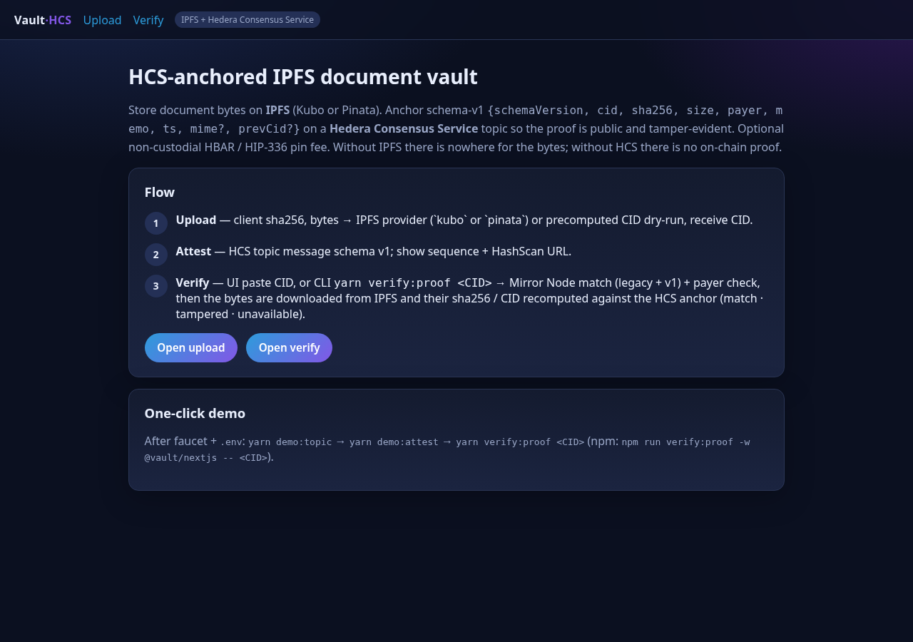
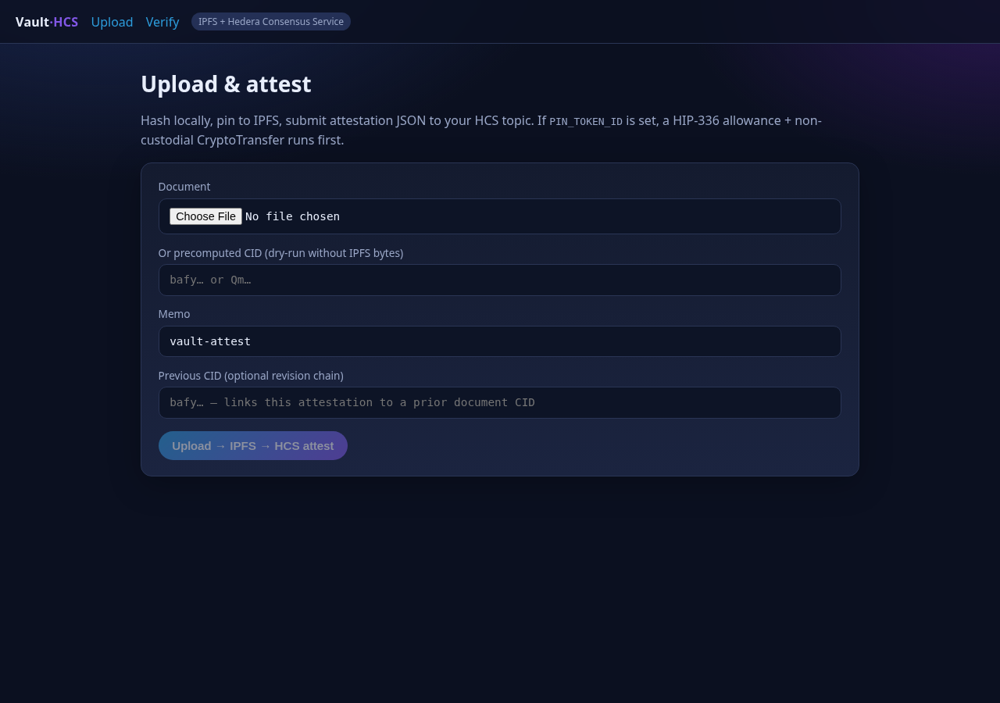
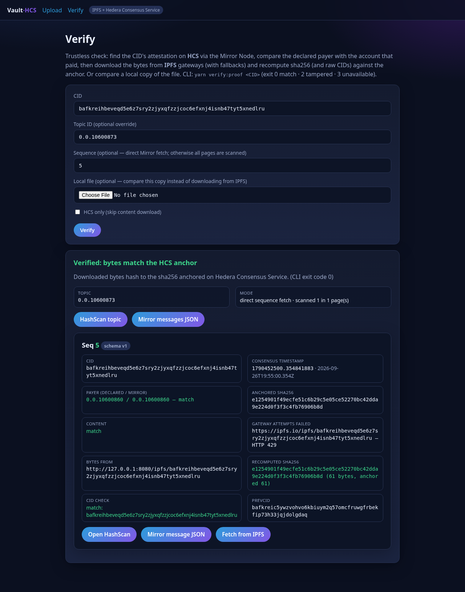
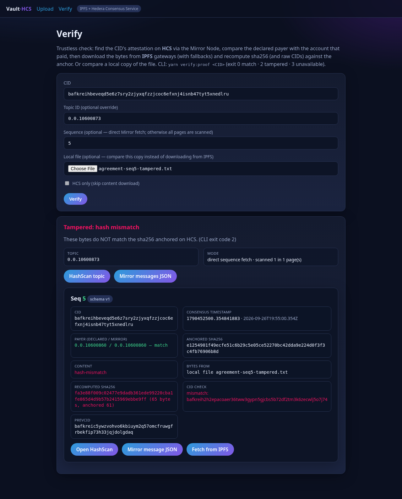
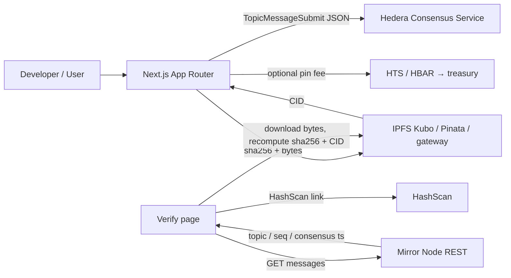

# HCS-anchored IPFS Document Vault

[](https://github.com/374group-tech/hcs-ipfs-document-vault/actions/workflows/ci.yml)

> Scaffold-HBAR external template: upload a document to **IPFS**, attest schema-v1 `{schemaVersion, cid, sha256, size, payer, memo, ts, mime?, prevCid?}` on a **Hedera Consensus Service** topic, optionally pay a non-custodial **HIP-336 / native HBAR pin fee**, and verify via Mirror Node + HashScan.

**Without IPFS there is nowhere for the bytes. Without HCS there is no public, tamper-evident proof.** Both are load-bearing.

```bash
npm create scaffold-hbar@latest -- vault-app --template 374group-tech/hcs-ipfs-document-vault
# non-interactive (what CI runs): add -f nextjs-app -s hardhat --package-manager yarn --network testnet --ci --skip-hedera-skills
```

Tested with **create-scaffold-hbar 0.4.1** (see [Status](#status--roadmap)); CI re-scaffolds from `main` on every push.

| Home | Upload |
| --- | --- |
|  |  |
| **Verify: match** (bytes downloaded, sha256 + raw CID recomputed) | **Verify: tampered file** (`hash-mismatch`, exit 2) |
|  |  |

## Why / Who is it for

**Problem:** when a document is shared, signed or issued, there is rarely a neutral record of *which exact bytes* existed *when*, and *who* anchored them. That gap produces "I signed a different version" disputes, silently edited reports and forged certificates, and settling them usually means trusting whoever holds the file.

**Target use cases** (what the template is designed for; no customers, partners or pilots are claimed):

| | Use case | What the vault proves |
| --- | --- | --- |
| **A** | **Contracts and legal documents** (lead demo: `agreement` with Bob → Mallory tampered) | Which exact version was anchored, and when (HCS consensus timestamp). A different version fails verify with `hash-mismatch`, which stops "I signed a different version" disputes. |
| **B** | **Audit and financial reports** | A tamper-evident filing trail: each revision is a new attest whose `prevCid` points at the previous one, so the revision chain is ordered and public. |
| **C** | **Diplomas and certificates** | Anyone can check an issued certificate against the issuer's topic without calling the issuer; a fake or edited copy fails. |

**How:** the bytes go to **IPFS** (content-addressed CID). A schema-v1 message with **CID + sha256 + payer** is anchored on a **Hedera Consensus Service** topic (optionally gated by a **submit key**, so only the issuer can write). **Trustless verify** (`/verify` or `yarn verify:proof`) reads the anchor from the Mirror Node, cross-checks the payer, downloads the bytes from IPFS and recomputes sha256 and the CID itself. No server of ours has to be trusted.

---

## 5-minute path (scaffold → run → upload → attest → verify)

Exact commands judges and developers can paste. Full click-through: [docs/DEMO.md](./docs/DEMO.md) · ops detail: [RUNBOOK.md](./RUNBOOK.md).

```bash
# 0) clone / scaffold, then from this repo root:
cp .env.example .env
cp packages/nextjs/.env.example packages/nextjs/.env.local
# Edit .env — required for live attest:
#   HEDERA_ACCOUNT_ID=0.0.x
#   HEDERA_PRIVATE_KEY=…   # never commit

yarn install                 # or: npm install
yarn lint && yarn test && yarn build

# 1) Create HCS topic (funded testnet account from portal faucet)
yarn demo:topic              # prints + writes HCS_TOPIC_ID=0.0.…

# 2a) Happy path — local Kubo (or IPFS_PROVIDER=pinata + PINATA_JWT)
ipfs daemon &                # API http://127.0.0.1:5001
yarn demo:attest             # IPFS add → HCS submit schema v1 → HashScan URL

# 2b) Dry-run — HCS-only with a precomputed CID (no Kubo)
DEMO_PRECOMPUTED_CID=bafybeigdyrzt5sfp7udm7hu76uh7y26nf3efuylqabf3oclgtqy55fbzdi \
  yarn demo:attest

# 3) CLI trustless verify (Mirror Node anchor → payer check → IPFS bytes → sha256/CID)
yarn verify:proof <CID>                 # uses HCS_TOPIC_ID from .env
# yarn verify:proof <CID> --topic 0.0.x --sequence N [--file ./copy.pdf | --skip-content]

# 4) UI: upload → attest → verify
yarn next:dev                # http://localhost:3000
#   /upload  — file or precomputed CID → IPFS → HCS (writes schema v1)
#   /verify  — paste CID (+ optional local file) → Mirror match → IPFS download → match / tampered / unavailable
```

npm equivalents: `npm run demo:topic -w @vault/nextjs`, `npm run demo:attest -w @vault/nextjs`, `npm run verify:proof -w @vault/nextjs -- <CID>`, `npm run next:dev`.

**Expected attest stdout:** `sequenceNumber=…`,  
`HashScan message (tx): https://hashscan.io/testnet/transaction/<transactionId>` and  
`HashScan topic messages: https://hashscan.io/testnet/topic/<HCS_TOPIC_ID>/messages`.

> HashScan has no `/topic/<id>/<sequence>` page. Link one message by its consensus timestamp (`/transaction/<seconds.nanos>`) or transaction ID; `yarn verify:proof` prints the timestamp form as `hashScanUrl`.

---

## Why this pattern

**Ecosystem integration (rubric: 35 pts):** [decentralised storage](https://docs.ipfs.tech/) via **IPFS** — load-bearing, not decorative. IPFS supplies the content-addressed blob (CID); HCS notarizes `{cid, sha256, …}`. **Remove IPFS → no durable document blob / CID.** Remove HCS → no ordered, tamper-evident public attest.

| Piece | Role |
| --- | --- |
| **IPFS** | Decentralised storage for document bytes (CID). Required. |
| **HCS** | Ordered consensus messages anchoring CID + sha256 + payer. |
| **Mirror Node** | Read path for verify (no custom indexer); `payer_account_id` cross-checks the declared payer. |
| **IPFS gateways** | Verify downloads the bytes (timeout + fallbacks) and recomputes sha256 and, for raw CIDs, the CID itself via `multiformats`. |
| **Optional pin fee** | HIP-336 / native HBAR CryptoTransfer payer → treasury. |

Attestation JSON is **schema v1** on write (`schemaVersion: 1`, optional `mime` / `prevCid` revision chain). Verify still accepts **legacy** messages without `schemaVersion`. Details: [docs/SCHEMA.md](./docs/SCHEMA.md).

This is **not** an x402 S3 paywall, not a DEX checkout, and not a SaucerSwap merchant flow.

## Architecture (one-pager)


```mermaid
flowchart LR
  User[Developer / User] --> UI[Next.js App Router]
  UI -->|sha256 + bytes| IPFS[IPFS Kubo / Pinata / gateway]
  IPFS -->|CID| UI
  UI -->|TopicMessageSubmit JSON| HCS[Hedera Consensus Service]
  UI -->|optional pin fee| Fee[HTS / HBAR → treasury]
  Verify[Verify page] -->|GET messages| Mirror[Mirror Node REST]
  Mirror -->|topic / seq / consensus ts| Verify
  Verify -->|HashScan link| HashScan[HashScan]
  Verify -->|download bytes, recompute sha256 + CID| IPFS
```

Static diagram: [docs/assets/architecture.svg](./docs/assets/architecture.svg) · screenshot checklist: [docs/assets/README.md](./docs/assets/README.md).

**Composition:** upload bytes → IPFS CID → client `sha256` → `TopicMessageSubmit` → verify via Mirror Node (topic, sequence, consensus timestamp) + HashScan (+ fetch blob from IPFS). Live proofs: [Status & roadmap](#status--roadmap).

## Monorepo layout

```
packages/
  ledger/    Pure helpers: sha256, attestation schema, HashScan/Mirror/IPFS URLs, bigint money
  hardhat/   Reference-only PinFeeCollector.sol (not deployed, not used by the app; see below)
  nextjs/    App Router UI + API routes + demo:topic / demo:attest / verify:proof
docs/        DEMO.md · SCHEMA.md · examples/ (original + tampered files) · screenshots/ · assets/
```

Package manager: **Yarn 3.2.3** workspaces **and** npm. Internal deps use `"@vault/ledger": "*"`, not `workspace:*`. Node **≥ 20.18.3**.

## Package scripts (root)

| Script | What it does |
| --- | --- |
| `yarn lint` / `yarn test` / `yarn build` | Gate across `ledger` + `hardhat` + `nextjs` |
| `yarn next:dev` | App Router UI (`/`, `/upload`, `/verify`) |
| `yarn demo:topic` | Create HCS topic → writes `HCS_TOPIC_ID` |
| `yarn demo:attest` | IPFS add → HCS schema-v1 submit → HashScan URL |
| `yarn verify:proof <CID>` | Trustless verify (HCS anchor + payer + IPFS bytes); exit codes in [Verify states](#verify-states) |
| `yarn hardhat:compile` / `yarn hardhat:test` / `yarn hardhat:deploy` | Reference `PinFeeCollector` (optional) |

Workspace equivalents: `npm run <script>` or `npm run <script> -w @vault/nextjs` for nextjs-only scripts.

## Prerequisites

1. Node.js ≥ 20.18.3
2. Yarn 3.2.3 via `.yarn/releases/yarn-3.2.3.cjs` (or Corepack)
3. Hedera testnet account + HBAR from the [portal faucet](https://portal.hedera.com/faucet)
4. Local [Kubo](https://docs.ipfs.tech/install/command-line/) (`ipfs daemon`, API `127.0.0.1:5001`), **or** `IPFS_PROVIDER=pinata` + `PINATA_JWT`, **or** a precomputed CID for dry-run

## Env table

Copy roots: `cp .env.example .env` and `cp packages/nextjs/.env.example packages/nextjs/.env.local`. Server routes also load the monorepo root `.env`.

| Key | Required | Description |
| --- | --- | --- |
| `HEDERA_ACCOUNT_ID` | yes (live) | Operator `0.0.x` |
| `HEDERA_PRIVATE_KEY` | yes (live) | Operator key — **never commit** |
| `HEDERA_NETWORK` | no | `testnet` (default) or `mainnet` |
| `HCS_TOPIC_ID` | yes (attest/verify) | Topic for vault messages (`yarn demo:topic`) |
| `HCS_SUBMIT_KEY` | no | Submit key for **new** topics: `operator` (reuse operator key) or a dedicated private key — **never commit**. Unset = public topic. See [Topic submit key](#topic-submit-key) |
| `HEDERA_MIRROR_NODE_URL` | no | Mirror REST (default public testnet/mainnet) |
| `IPFS_PROVIDER` | no | `kubo` (default) or `pinata` |
| `IPFS_API_URL` | happy path (kubo) | Kubo HTTP API (default `http://127.0.0.1:5001`) |
| `IPFS_GATEWAY_URL` | no | Primary gateway for fetch links and content verify (default `https://ipfs.io/ipfs`) |
| `IPFS_GATEWAY_FALLBACKS` | no | CSV of extra gateways tried next (e.g. `http://127.0.0.1:8080/ipfs`), then ipfs.io, dweb.link, w3s.link |
| `IPFS_GATEWAY_TIMEOUT_MS` | no | Per-gateway timeout for content verify (default `15000`) |
| `PINATA_JWT` | pinata | Pinata JWT — **never commit** |
| `PINATA_API_KEY` / `PINATA_API_SECRET` | pinata alt | Legacy Pinata key pair if no JWT |
| `PIN_TOKEN_ID` | no | `HBAR` / `0.0.0` or HTS id → pin fee; unset = free attest |
| `PIN_FEE_AMOUNT` | no | Base units as bigint string (tinybars if HBAR) |
| `PIN_TREASURY_ACCOUNT_ID` | no | Receives pin fee |
| `NEXT_PUBLIC_*` | no | Safe client mirrors of network / topic / gateway / pin |

`template.json` `envVars` entries are `{key, description}` only (Zod-valid for create-scaffold-hbar).

## Troubleshooting

| Symptom | Cause | Fix |
| --- | --- | --- |
| `IPFS API unreachable` / Kubo upload fails | Kubo not running or wrong `IPFS_API_URL` | Start `ipfs daemon` (API `127.0.0.1:5001`) or use dry-run CID |
| Pinata pin / auth fails | Missing or invalid Pinata creds | Set `IPFS_PROVIDER=pinata` and `PINATA_JWT` (never commit); or switch back to Kubo / dry-run |
| `yarn verify:proof` → match=no | Wrong topic / lag / CID | Confirm `HCS_TOPIC_ID`; wait a few seconds after attest; try `--sequence N` |
| `verdict=content-unavailable` (exit 3) | Public gateways rate-limit (HTTP 429) or nobody is providing the CID | Keep the file pinned (Kubo / Pinata); add your gateway to `IPFS_GATEWAY_FALLBACKS`; or check a local copy with `--file` |
| `INVALID_SIGNATURE` on attest | Topic has a submit key you do not hold | Set `HCS_SUBMIT_KEY` to the key the topic was created with |
| `HEDERA_ACCOUNT_ID and HEDERA_PRIVATE_KEY are required` | Missing keys | Fill `.env` from [portal faucet](https://portal.hedera.com/faucet); never commit |
| `Unable to parse HEDERA_PRIVATE_KEY` | Wrong key format | ECDSA or ED25519 hex/DER from portal; no quotes/spaces |
| `HCS_TOPIC_ID is required` | No topic yet | `yarn demo:topic` then re-run attest |
| Mirror verify empty / no match | Lag or wrong topic | Wait a few seconds after submit; confirm topic id matches attest |
| Dry-run vs live | Dry-run = HCS message only | Production still needs real bytes on IPFS; dry-run CID is demo-only |
| `yarn` / npm workspace resolve fails | Wrong dep protocol | Use `"@vault/ledger": "*"` and root `workspaces` |
| Lint fails on Hardhat | Compile order | Root `yarn lint` compiles Hardhat first (see package scripts) |

## Product behaviour

1. **Upload** — client hashes sha256; bytes → IPFS provider (`kubo` or `pinata`) or precomputed CID dry-run → CID.
2. **Attest** — `TopicMessageSubmit` with schema-v1 JSON `{schemaVersion:1, cid, sha256, size, payer, memo, ts, mime?, prevCid?}`; UI shows sequence + HashScan links (message via `…/transaction/<id>`, topic `…/topic/<id>/messages`).
3. **Optional pin fee** — if `PIN_TOKEN_ID` set: native HBAR CryptoTransfer or HIP-336 allowance + transfer payer → treasury. Else free attest (network fee only).
4. **Verify** — `yarn verify:proof <CID>` or UI paste CID/sequence → Mirror Node (paging through `links.next`) → attestation (legacy + v1) → payer check → bytes from IPFS (or a local file) → sha256 + CID recomputed. See [Verify states](#verify-states).
5. **One-click demo** — `yarn demo:attest` / `npm run demo:attest -w @vault/nextjs`.

### IPFS notes (load-bearing)

- Happy path: Next.js `POST /api/ipfs/add` uses `IPFS_PROVIDER` (`kubo` default → `IPFS_API_URL`, or `pinata` → `PINATA_JWT`).
- Dry-run: `precomputedCid` (UI) or `DEMO_PRECOMPUTED_CID` — works with **no** provider; demo only; production needs real bytes on IPFS.
- Optional: public add endpoint via form field `publicAddUrl` (legacy fallback).
- **If IPFS is removed, the product breaks:** no durable document blob / CID. HCS alone only notarizes a hash of bytes it never held.

### `yarn verify:proof`

```bash
yarn verify:proof bafk…                         # HCS_TOPIC_ID from .env; scans every page
yarn verify:proof bafk… --topic 0.0.10600873 --sequence 5
yarn verify:proof bafk… --sequence 5 --file ./received-copy.txt   # check a local copy
yarn verify:proof bafk… --sequence 5 --skip-content               # HCS anchor only
```

Steps:

1. **HCS anchor**: with `--sequence`, `GET /topics/{id}/messages/{seq}`; otherwise every page of
   `GET /topics/{id}/messages` via `links.next` (`--max-pages`, default 50 × 100 messages). The newest match
   wins, unless its payer is flagged and an older one is not.
2. **Payer check**: the `payer` field in the JSON is written by whoever submitted it. The CLI compares it with
   Mirror's `payer_account_id` (the account that actually paid and signed). On a public topic anyone can post a
   message claiming your account; this check exposes that.
3. **Content**: downloads the CID from `IPFS_GATEWAY_URL`, then `IPFS_GATEWAY_FALLBACKS`, then ipfs.io,
   dweb.link and w3s.link (per-gateway timeout, 25 MB cap), or reads `--file`. It recomputes sha256 and compares
   it with the sha256 anchored on HCS.
4. **CID**: for CIDv1 `raw` + sha2-256 (`bafkrei…`, what Kubo `--cid-version=1` and Pinata produce for
   small files) the CID is recomputed from the bytes with `multiformats` and must match too. dag-pb/UnixFS CIDs
   (`Qm…`, `bafybei…`) depend on the adder's chunker and DAG layout, so the CLI prints
   `cidCheck=not-recomputable` and only the sha256 is checked. It does not report a CID match it didn't compute.

### Verify states

The CLI prints `verdict=…` and exits with the matching code. `/api/hcs/verify` returns the same `verdict` and `exitCode`,
and the `/verify` page shows it as a banner.

| `verdict` | Exit | Meaning |
| --- | --- | --- |
| `match` | 0 | Anchored on HCS, payer consistent, bytes hash to the anchored sha256 (and raw CID recomputes) |
| `hcs-only` | 0 | Anchored, content check skipped (`--skip-content` / `content=skip`) |
| `not-anchored` | 1 | No attestation for this CID (or the sequence attests another CID); also usage / network errors |
| `hash-mismatch` | 2 | **Tampered**: the bytes do not match the anchored sha256, or a raw CID does not match the bytes |
| `content-unavailable` | 3 | Anchored, but no gateway returned the bytes before the timeout |
| `payer-mismatch` | 4 | Declared `payer` differs from Mirror `payer_account_id` |

API: `GET /api/hcs/verify?cid=…&sequence=…[&topicId=…][&content=skip]` downloads from gateways;
`POST /api/hcs/verify` (multipart `file`, `cid`, `sequence`, `topicId`) checks an uploaded copy instead.

Tamper demo with bundled files ([docs/examples](./docs/examples/README.md)); CI runs both:

```bash
CID=bafkreihbeveqd5e6z7sry2zjyxqfzzjcoc6efxnj4isnb47tyt5xnedlru
yarn verify:proof $CID --topic 0.0.10600873 --sequence 5 --file docs/examples/agreement-seq5.txt           # verdict=match, exit 0
yarn verify:proof $CID --topic 0.0.10600873 --sequence 5 --file docs/examples/agreement-seq5-tampered.txt  # verdict=hash-mismatch, exit 2
```

### Topic submit key

By default `yarn demo:topic` creates a **public** topic: anyone can submit messages, and the payer check above is how
spoofed attestations get flagged. To limit who can write, set `HCS_SUBMIT_KEY` before creating the topic:

```bash
HCS_SUBMIT_KEY=operator yarn demo:topic      # submit key = operator's public key
HCS_SUBMIT_KEY=302e0201…  yarn demo:topic    # dedicated DER / hex private key (never commit)
```

`TopicCreateTransaction.setSubmitKey(publicKey)` is set and `demo:topic` prints the key. Keep the same
`HCS_SUBMIT_KEY` in `.env`: `demo:attest` and `/upload` sign every `TopicMessageSubmit` with it, and the network
rejects unsigned messages with `INVALID_SIGNATURE`. Verifying doesn't need the key.

## Status & roadmap

Honest status from this workspace (Asia/Yerevan). Do not claim commands you have not run.

**Judge-facing HashScan proofs (IPFS + HCS + optional HBAR pin):** topic [`0.0.10600873`](https://hashscan.io/testnet/topic/0.0.10600873) · [messages](https://hashscan.io/testnet/topic/0.0.10600873/messages) · **schema v1** seq [6](https://hashscan.io/testnet/transaction/1790716111.334362104) (demo video v2 attest, CID `bafkreigssrxkydx62c7o53mg45qdyn5yu5ng22cr6llon7xmwni3zsukga`, `prevCid` → seq 5) · **schema v1** seq [5](https://hashscan.io/testnet/transaction/1790452500.354841883) (demo-video attest from `/upload`, CID `bafkreihbeveqd5e6z7sry2zjyxqfzzjcoc6efxnj4isnb47tyt5xnedlru`, `prevCid` → seq 4) · **schema v1** seq [4](https://hashscan.io/testnet/transaction/1790146037.223851181) (CID `bafkreic5ywzvohvo6kbiuym2q57omcfruwgfrbekfip73h33jqjdolgdaq`, `prevCid` → legacy) · **legacy** seq [3](https://hashscan.io/testnet/transaction/1789747927.579637159) · pin [transfer](https://hashscan.io/testnet/transaction/0.0.10600860%401789747920.746708423) · submit-key-gated topic [`0.0.10782484`](https://hashscan.io/testnet/topic/0.0.10782484). All validate via `yarn verify:proof`. Full table below.

| Milestone | Command | Result |
| --- | --- | --- |
| Template tree | — | Present at repo root (`packages/ledger`, `hardhat`, `nextjs`) |
| `yarn install` | `yarn install` (Yarn 3.2.3) | **PASS** (2026-09-18) |
| `npm install` | fresh copy `npm install` | **PASS** (2026-09-18; 1162 packages) |
| Lint | `yarn lint` | **PASS** (2026-09-27) |
| Unit tests | `yarn test` | **PASS** (2026-09-27) — ledger + Hardhat + nextjs |
| Build | `yarn build` | **PASS** (2026-09-27) — ledger + Hardhat compile + Next.js |
| Fresh `create-scaffold-hbar@0.4.1` | `npm create scaffold-hbar@latest -- vault-app --template 374group-tech/hcs-ipfs-document-vault -f nextjs-app -s hardhat --package-manager yarn --ci --skip-install --skip-hedera-skills` | **PASS** (2026-09-29 Asia/Yerevan); also the `scaffold-smoke` CI job on every push to `main` |
| CI | [GitHub Actions](https://github.com/374group-tech/hcs-ipfs-document-vault/actions/workflows/ci.yml) | install · lint (incl. `tsc`) · test · build, live testnet proof checks, fresh-scaffold smoke |
| Create topic | `yarn demo:topic` | **PASS** — topic [`0.0.10600873`](https://hashscan.io/testnet/topic/0.0.10600873) |
| Local Kubo IPFS | `ipfs daemon` + API `:5001` | **PASS** — add source=`kubo` |
| HBAR pin fee | `PIN_TOKEN_ID=HBAR` | **PASS** — 100000 tinybar → treasury [`0.0.10604200`](https://hashscan.io/testnet/account/0.0.10604200) · [transfer](https://hashscan.io/testnet/transaction/0.0.10600860%401789747920.746708423) |
| Demo attest (legacy) | `yarn demo:attest` | **PASS** (2026-09-18) — HCS seq [3](https://hashscan.io/testnet/transaction/1789747927.579637159) · Kubo CID `bafkreif7ckqfqbizpthadxlizpgwlgujq6lv3uj26ef2bshy4n2kyd2yny` · [tx](https://hashscan.io/testnet/transaction/0.0.10600860%401789747921.086074708) |
| Schema v1 attest + `prevCid` | `DEMO_PREV_CID=… yarn demo:attest` | **PASS** (2026-09-23 Asia/Yerevan) — HCS seq [4](https://hashscan.io/testnet/transaction/1790146037.223851181) · Kubo CID `bafkreic5ywzvohvo6kbiuym2q57omcfruwgfrbekfip73h33jqjdolgdaq` · `schemaVersion=1` · [tx](https://hashscan.io/testnet/transaction/0.0.10600860%401790146030.930645533) |
| Schema v1 attest via UI (demo video) | `/upload` (Kubo) | **PASS** (2026-09-26 Asia/Yerevan) — HCS seq [5](https://hashscan.io/testnet/transaction/1790452500.354841883) · Kubo CID `bafkreihbeveqd5e6z7sry2zjyxqfzzjcoc6efxnj4isnb47tyt5xnedlru` · `schemaVersion=1` · `prevCid` → seq 4 · [tx](https://hashscan.io/testnet/transaction/0.0.10600860%401790452493.938386811) |
| Schema v1 attest (demo video v2) | `/upload` (Kubo) | **PASS** (2026-09-30 01:08 Asia/Yerevan) — HCS seq [6](https://hashscan.io/testnet/transaction/1790716111.334362104) on topic `0.0.10600873` · CID `bafkreigssrxkydx62c7o53mg45qdyn5yu5ng22cr6llon7xmwni3zsukga` · `schemaVersion=1` · `prevCid` → seq 5 · `payerCheck=match`; `yarn verify:proof` → `match` (sha256 + raw CID recomputed via local Kubo gateway, 2026-09-30) |
| CLI verify (HCS anchor) | `yarn verify:proof <CID> --topic 0.0.10600873 --sequence N --skip-content` | **PASS** (2026-09-29) — seq 1–5 `hcs-only`, exit 0; `payerCheck=match` on all five |
| CLI trustless verify | `yarn verify:proof <CID> --topic 0.0.10600873 --sequence N` | seq 4, 5: `match` (sha256 + raw CID recomputed) when a gateway serves the bytes (public gateways answered 429 from the dev box; local Kubo gateway via `IPFS_GATEWAY_FALLBACKS` worked). seq 2, 3: bytes bundled in `docs/examples`, `--file` → `match`. seq 1: dry-run placeholder CID → `hash-mismatch` (expected, see [examples](./docs/examples/README.md)) |
| Tamper demo | `--file docs/examples/agreement-seq5-tampered.txt` | **PASS**: `hash-mismatch`, exit 2 (also asserted in CI) |
| Topic submit key | `HCS_SUBMIT_KEY=<ED25519> ` create + attest | **PASS** (2026-09-29): gated topic [`0.0.10775303`](https://hashscan.io/testnet/topic/0.0.10775303) ([create tx](https://hashscan.io/testnet/transaction/0.0.10600860%401790678930.876029437)); signed attest seq [1](https://hashscan.io/testnet/transaction/1790678937.359058295) verifies `match`; an unsigned submit was rejected with `INVALID_SIGNATURE` |
| Topic submit key (re-run) | `HCS_SUBMIT_KEY=<ED25519>` create + attest | **PASS** (2026-09-30 Asia/Yerevan, Mirror Node checked): gated topic [`0.0.10782484`](https://hashscan.io/testnet/topic/0.0.10782484) with an ED25519 `submit_key` ([create tx](https://hashscan.io/testnet/transaction/0.0.10600860%401790716543.438353112), `SUCCESS`); signed attest seq [1](https://hashscan.io/testnet/transaction/0.0.10600860%401790716565.681482085) `SUCCESS`; unsigned submit [rejected](https://hashscan.io/testnet/transaction/0.0.10600860%401790716587.656428126) with `INVALID_SIGNATURE` |
| App routes | `yarn next:start` smoke | **PASS** — `/`, `/upload`, `/verify` returned HTTP 200 |

## Local create-scaffold-hbar self-check

Tested with create-scaffold-hbar **0.4.1** on 2026-09-29 (Asia/Yerevan). Both forms scaffolded cleanly (`.env` isn't copied):

```bash
# from GitHub (what users run; CI job scaffold-smoke also installs + runs tests)
npm create scaffold-hbar@latest -- vault-app --template 374group-tech/hcs-ipfs-document-vault \
  -f nextjs-app -s hardhat --package-manager yarn --network testnet --ci --skip-install --skip-hedera-skills

# from a local checkout
CREATE_SCAFFOLD_HBAR_TEMPLATE_DIR=/absolute/path/to/hcs-ipfs-document-vault \
  npx --yes create-scaffold-hbar@0.4.1 vault-app \
  -f nextjs-app -s hardhat --package-manager npm --network testnet \
  --ci --skip-install --skip-hedera-skills
```

Without `-s hardhat` the CLI defaults to Foundry and fails if `forge` isn't installed.

## Pin fee (SDK-native) and the reference contract

The live pin fee is **SDK-native**. With `PIN_TOKEN_ID=HBAR` it's a CryptoTransfer payer → treasury
([testnet tx](https://hashscan.io/testnet/transaction/0.0.10600860%401789747920.746708423)); with an HTS token id
it's a HIP-336 allowance + transfer. No contract is involved.

`packages/hardhat/contracts/PinFeeCollector.sol` is a **reference only**. It's an EVM version of the same non-custodial
fee sink for builders who'd rather collect fees on-chain. It is **not deployed** by this template and the app doesn't
call it. It's compiled, linted and unit-tested in CI so it stays correct if you deploy it yourself:

```bash
yarn hardhat:compile && yarn hardhat:test
# HEDERA_EVM_PRIVATE_KEY (ECDSA, hex) + PIN_TREASURY_EVM_ADDRESS, then:
yarn hardhat:deploy --network hederaTestnet
```

Money amounts use **bigint** base units (`@vault/ledger` `toBaseUnits` / `hbarToTinybar`). No floats for money. No custodial hop.

## Licence

MIT — see [LICENSE](./LICENSE).

## Links

- [Scaffold-HBAR Template Bounty](https://hedera.com/blog/scaffold-hbar-template-bounty/)
- [Hedera portal faucet](https://portal.hedera.com/faucet)
- [HashScan testnet](https://hashscan.io/testnet)
- [Kubo / IPFS](https://docs.ipfs.tech/)
- [Demo walkthrough](./docs/DEMO.md)
- [Attestation schema](./docs/SCHEMA.md)
- [Submission checklist](./SUBMIT.md)
