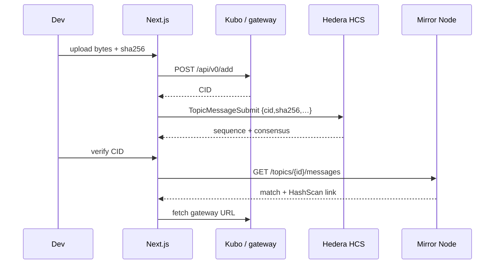

# Demo walkthrough (judges / developers)

Five minutes from clone → HashScan proof. Screenshots are placeholders — drop real captures under `docs/assets/` if you record them.

## Path (CLI)

```text
.env keys → yarn install → yarn demo:topic → (ipfs daemon) → yarn demo:attest → HashScan URL
```

```bash
cp .env.example .env
# set HEDERA_ACCOUNT_ID + HEDERA_PRIVATE_KEY (portal faucet)
yarn install
yarn demo:topic          # writes HCS_TOPIC_ID
ipfs daemon &            # or skip and use DEMO_PRECOMPUTED_CID (dry-run)
yarn demo:attest         # prints sequenceNumber + HashScan topic message URL
```

Dry-run (HCS-only, no Kubo):

```bash
DEMO_PRECOMPUTED_CID=bafybeigdyrzt5sfp7udm7hu76uh7y26nf3efuylqabf3oclgtqy55fbzdi \
  yarn demo:attest
```

## Path (UI)

```bash
yarn next:dev
# http://localhost:3000/upload  → file or precomputed CID → attest
# http://localhost:3000/verify  → paste CID → Mirror Node match + HashScan
```

## Flow diagram



## Screenshot placeholders

| Step | Placeholder | What to capture |
| --- | --- | --- |
| 1. Upload | `` | `/upload` with file chosen / CID shown |
| 2. Attest result | `` | Sequence number + HashScan link |
| 3. Verify match | `` | Topic / seq / consensus timestamp / HashScan |
| 4. HashScan | `` | Topic message page on testnet |

Create `docs/assets/` when you add real PNGs. Until then, the Mermaid diagram + live HashScan links in the root README **Status & roadmap** are enough for judges.

## Live proof (reference)

See README **Status & roadmap** for the current testnet topic / sequence / pin-fee transfer URLs.
