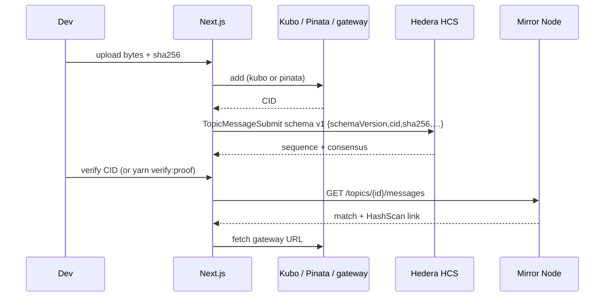

# Demo walkthrough (judges / developers)

Five minutes from clone → HashScan proof → `yarn verify:proof`. Screenshots are placeholders — drop real captures under `docs/assets/` if you record them.

## Path (CLI)

```text
.env keys → yarn install → yarn demo:topic → (ipfs daemon | pinata) → yarn demo:attest → yarn verify:proof <CID> → HashScan
```

```bash
cp .env.example .env
# set HEDERA_ACCOUNT_ID + HEDERA_PRIVATE_KEY (portal faucet)
yarn install
yarn demo:topic          # writes HCS_TOPIC_ID
ipfs daemon &            # or IPFS_PROVIDER=pinata + PINATA_JWT; or DEMO_PRECOMPUTED_CID dry-run
yarn demo:attest         # prints sequenceNumber + HashScan (writes schema v1)
# Optional revision chain:
# DEMO_PREV_CID=<priorCid> DEMO_MIME=text/plain yarn demo:attest
yarn verify:proof <CID>  # Mirror Node match → exit 0/1 (accepts legacy + schema v1)
```

Dry-run (HCS-only, no Kubo/Pinata):

```bash
DEMO_PRECOMPUTED_CID=bafybeigdyrzt5sfp7udm7hu76uh7y26nf3efuylqabf3oclgtqy55fbzdi \
  yarn demo:attest
```

## Path (UI)

```bash
yarn next:dev
# http://localhost:3000/upload  → file or precomputed CID → attest (schema v1)
# http://localhost:3000/verify  → paste CID → Mirror Node match + HashScan
# CLI equivalent: yarn verify:proof <CID>
```

## Flow diagram



## Screenshot placeholders

| Step | Placeholder | What to capture |
| --- | --- | --- |
| 1. Upload | `` | `/upload` with file chosen / CID shown |
| 2. Attest result | `` | Sequence number + HashScan link + schema v1 JSON |
| 3. Verify match | `` | Topic / seq / consensus timestamp / HashScan |
| 4. CLI verify | `` | `yarn verify:proof` stdout `match=yes` |
| 5. HashScan | `` | Topic message page on testnet |

PNG captures are optional — see [assets/README.md](./assets/README.md). Until then, Mermaid + [architecture.svg](./assets/architecture.svg) + README Status HashScan links are enough for judges.

## Exact judge path (live proofs)

Use the public topic and CIDs already attested on testnet (see README Status). No faucet keys required for verify.

```bash
# Schema v1 (seq 4) — expect match=yes, schemaVersion=1, prevCid set
yarn verify:proof bafkreic5ywzvohvo6kbiuym2q57omcfruwgfrbekfip73h33jqjdolgdaq \
  --topic 0.0.10600873 --sequence 4

# Legacy (seq 3) — expect match=yes, schemaVersion=legacy
yarn verify:proof bafkreif7ckqfqbizpthadxlizpgwlgujq6lv3uj26ef2bshy4n2kyd2yny \
  --topic 0.0.10600873 --sequence 3
```

HashScan: [seq 4 (schema v1)](https://hashscan.io/testnet/topic/0.0.10600873/4) · [seq 3 (legacy)](https://hashscan.io/testnet/topic/0.0.10600873/3) · [topic](https://hashscan.io/testnet/topic/0.0.10600873).

Architecture diagram (no screenshots required): [assets/architecture.svg](./assets/architecture.svg). Screenshot checklist: [assets/README.md](./assets/README.md).

