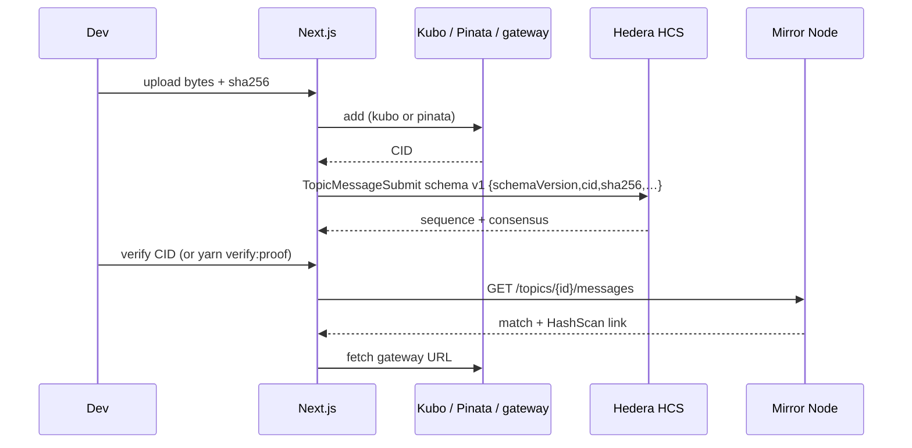

# Demo walkthrough (judges / developers)

Five minutes from clone → HashScan proof → trustless `yarn verify:proof`. Screenshots: [below](#screenshots).

## Path (CLI)

```text
.env keys → yarn install → yarn demo:topic → (ipfs daemon | pinata) → yarn demo:attest → yarn verify:proof <CID> → HashScan
```

```bash
cp .env.example .env
# set HEDERA_ACCOUNT_ID + HEDERA_PRIVATE_KEY (portal faucet)
yarn install
yarn demo:topic          # writes HCS_TOPIC_ID
ipfs daemon &            # or IPFS_PROVIDER=pinata + PINATA_JWT; or DEMO_PRECOMPUTED_CID dry-run
yarn demo:attest         # prints sequenceNumber + HashScan (writes schema v1)
# Optional revision chain:
# DEMO_PREV_CID=<priorCid> DEMO_MIME=text/plain yarn demo:attest
yarn verify:proof <CID>  # HCS anchor + payer check + IPFS bytes → exit 0 match / 2 tampered / 3 unavailable (legacy + schema v1)
```

Dry-run (HCS-only, no Kubo/Pinata):

```bash
DEMO_PRECOMPUTED_CID=bafybeigdyrzt5sfp7udm7hu76uh7y26nf3efuylqabf3oclgtqy55fbzdi \
  yarn demo:attest
```

## Path (UI)

```bash
yarn next:dev
# http://localhost:3000/upload  → file or precomputed CID → attest (schema v1)
# http://localhost:3000/verify  → paste CID → Mirror Node match + HashScan
# CLI equivalent: yarn verify:proof <CID>
```

## Flow diagram


```mermaid
sequenceDiagram
  participant Dev
  participant UI as Next.js
  participant IPFS as Kubo / Pinata / gateway
  participant HCS as Hedera HCS
  participant Mirror as Mirror Node
  Dev->>UI: upload bytes + sha256
  UI->>IPFS: add (kubo or pinata)
  IPFS-->>UI: CID
  UI->>HCS: TopicMessageSubmit schema v1 {schemaVersion,cid,sha256,…}
  HCS-->>UI: sequence + consensus
  Dev->>UI: verify CID (or yarn verify:proof)
  UI->>Mirror: GET /topics/{id}/messages
  Mirror-->>UI: match + HashScan link
  UI->>IPFS: fetch gateway URL
```

## Screenshots

Captured from `yarn next:start` with headless Chromium (2026-09-29): [docs/screenshots](./screenshots/).

| Home | Upload |
| --- | --- |
|  |  |
| **Verify seq 5: match** | **Verify seq 5 with the tampered file: hash-mismatch** |
|  |  |

In the match capture, ipfs.io answered HTTP 429 and the local Kubo gateway (`IPFS_GATEWAY_FALLBACKS`) served the bytes.
The page lists the failed attempts.

## Exact judge path (live proofs)

Use the public topic and CIDs already attested on testnet (see README Status). No faucet keys required for verify.

```bash
# Schema v1 (seq 5, demo video): download from IPFS gateways, recompute sha256 + raw CID
#   expect verdict=match (exit 0), or content-unavailable (exit 3) if every gateway rate-limits you
yarn verify:proof bafkreihbeveqd5e6z7sry2zjyxqfzzjcoc6efxnj4isnb47tyt5xnedlru --topic 0.0.10600873 --sequence 5

# Same anchor, bundled copies (offline, deterministic): original → match (0), tampered → hash-mismatch (2)
yarn verify:proof bafkreihbeveqd5e6z7sry2zjyxqfzzjcoc6efxnj4isnb47tyt5xnedlru --topic 0.0.10600873 --sequence 5 --file docs/examples/agreement-seq5.txt
yarn verify:proof bafkreihbeveqd5e6z7sry2zjyxqfzzjcoc6efxnj4isnb47tyt5xnedlru --topic 0.0.10600873 --sequence 5 --file docs/examples/agreement-seq5-tampered.txt

# Schema v1 (seq 4): expect schemaVersion=1, prevCid set, payerCheck=match
yarn verify:proof bafkreic5ywzvohvo6kbiuym2q57omcfruwgfrbekfip73h33jqjdolgdaq --topic 0.0.10600873 --sequence 4

# Legacy (seq 3): expect schemaVersion=legacy, verdict=match with the bundled bytes
yarn verify:proof bafkreif7ckqfqbizpthadxlizpgwlgujq6lv3uj26ef2bshy4n2kyd2yny --topic 0.0.10600873 --sequence 3 --file docs/examples/demo-seq3.txt
```

HashScan: [seq 5 (schema v1, demo video)](https://hashscan.io/testnet/transaction/1790452500.354841883) · [seq 4 (schema v1)](https://hashscan.io/testnet/transaction/1790146037.223851181) · [seq 3 (legacy)](https://hashscan.io/testnet/transaction/1789747927.579637159) · [all messages](https://hashscan.io/testnet/topic/0.0.10600873/messages) · [topic](https://hashscan.io/testnet/topic/0.0.10600873).

Architecture diagram: [assets/architecture.svg](./assets/architecture.svg). Verify states and exit codes: [README](../README.md#verify-states).

